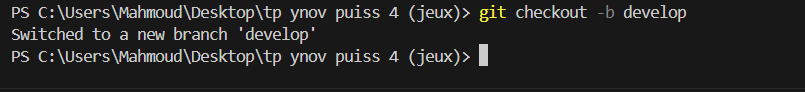
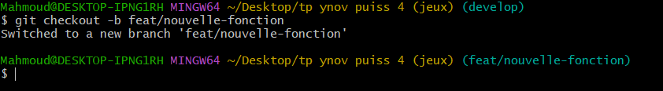
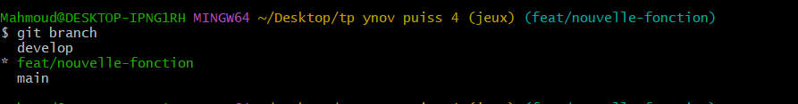

# Rapport du Projet Puissance 4
## 1. Conventions adoptées
### 1.1 Convention de nommage des branches
1.feat/ : Nouvelles fonctionnalités

2.fix/ : Corrections de bugs

3.hotfix/ : Corrections urgentes

4.develop : Branche de développement

5.main : Branche de production

### 1.2 Convention des messages de commit
Format Conventional Commits :

text

feat: ajout initialisation jeu

fix: correction validation colonne

docs: mise à jour README

1.3 Workflow Git

Git Feature Branch Workflow :

Développement sur branches feat/

Pull Requests vers develop

Merge régulier dans main

### 2. Branches créées

Branches principales

main - Code stable

develop - Intégration

Branches de fonctionnalités

feat/game-initialization - Initialisation jeu

feat/game-display - Affichage grille

feat/player-moves - Mouvements joueurs

feat/victory-conditions - Conditions victoire

feat/game-loop - Boucle principale

Branches de correction

fix/column-validation - Validation colonnes

fix/victory-check - Vérification victoire
### 3. Commandes Git utilisées:

